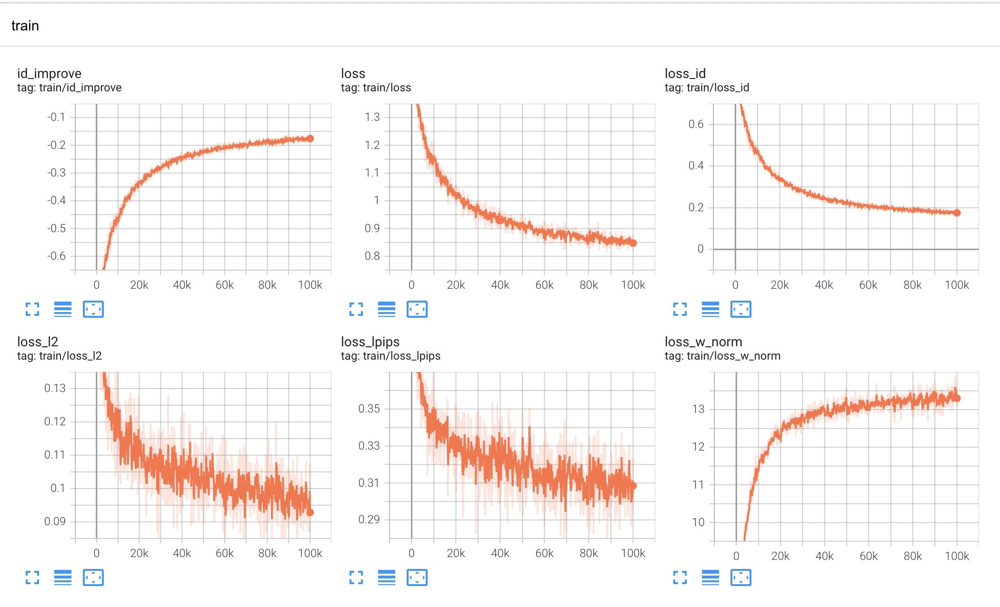
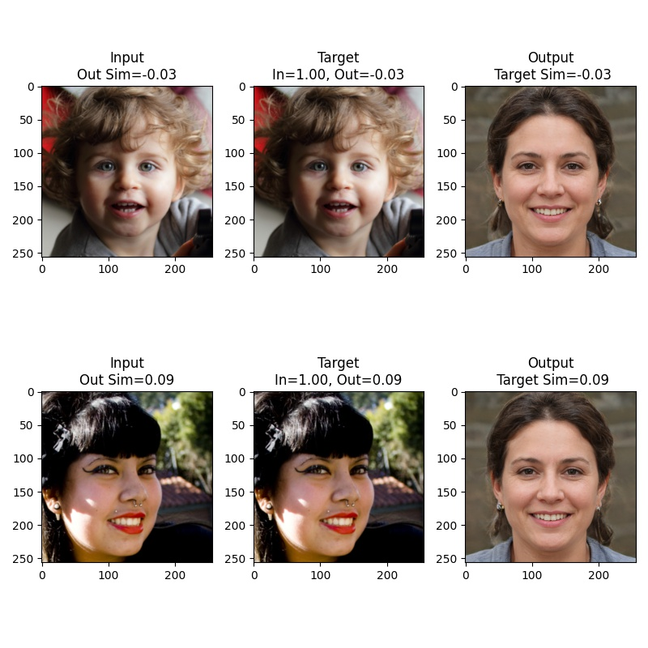
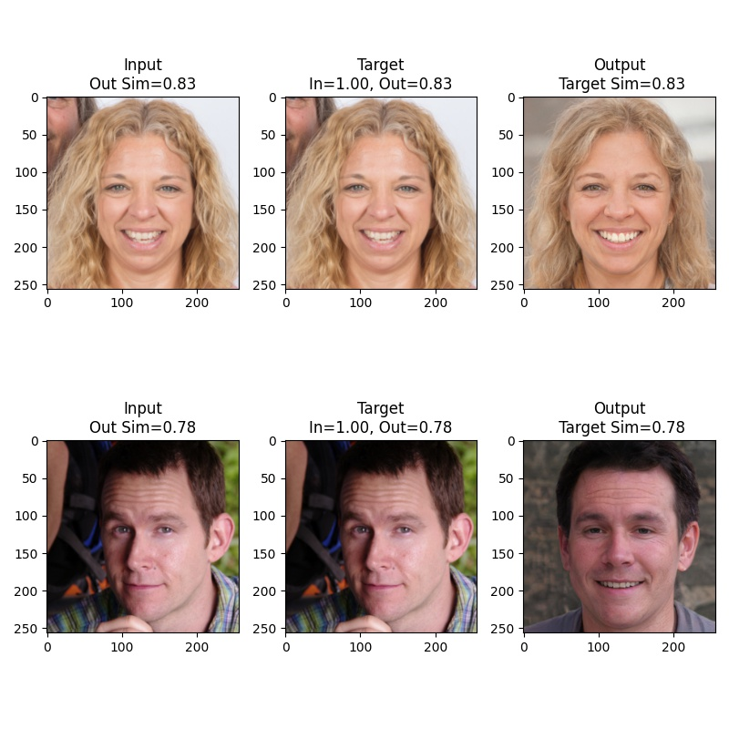

# pSp with MobileNetV3
  </a>
  </a>
  <a href="https://opensource.org/licenses/MIT"></a>
  <a href="https://github.com/eladrich/pixel2style2pixel"></a>


<p align="center">

<br>
The demo of different styles images of pSp-mbv3 framework.</p>

## Description  

Re-implementation of pSp that use mobilenet-v3 and stylegan2-256p. Then mix different styles by stylegan2 and convert to openvino.

## Citation

This code is heavily based on [pixel2style2pixel](https://github.com/eladrich/pixel2style2pixel) and [stylegan2-pytorch](https://github.com/rosinality/stylegan2-pytorch). Thanks `eladrich` and `rosinality` so much to make his work available 🙏🙏🙏 

## Pretrained Models

链接: https://pan.baidu.com/s/1CjJIvhUXk0f9ONPANK-fSg  密码: pjl8

## Training Log
### Tensorboard

<p align="center">

<br>
The loss of training.</p>

### inversions
<p align="center">


<br>
iteration 0 and iteration 100000.</p>

## Test
``` 
python scripts/inference.py \
--exp_dir=./sample \
--checkpoint_path=./ckpt/best_model.pt \
--data_path=./test_images \
--test_batch_size=4 \
--test_workers=2 \
--couple_outputs
```

## More
[Inference on openvino and more demo](https://github.com/TalkUHulk/realworld-stylegan2-encoder)


